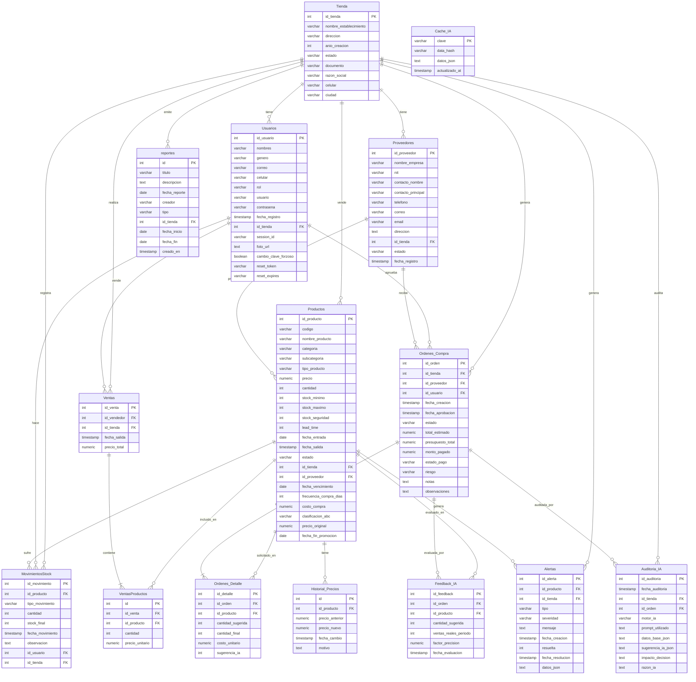

# Diagrama de Entidad Relación (ERD) - StockPilot

Este es el diagrama de la base de datos de StockPilot, generado a partir de la estructura real de PostgreSQL. Puedes copiar este código y pegarlo en cualquier visor de Mermaid (como [Mermaid Live](https://mermaid.live/) o usarlo directamente aquí en GitHub/Markdown).

