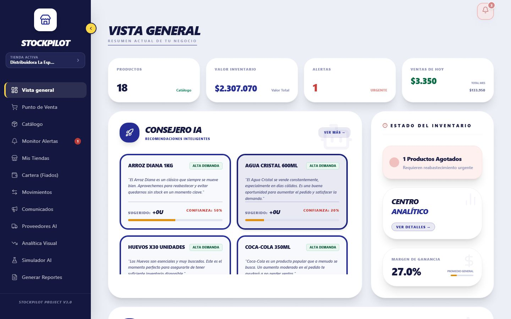
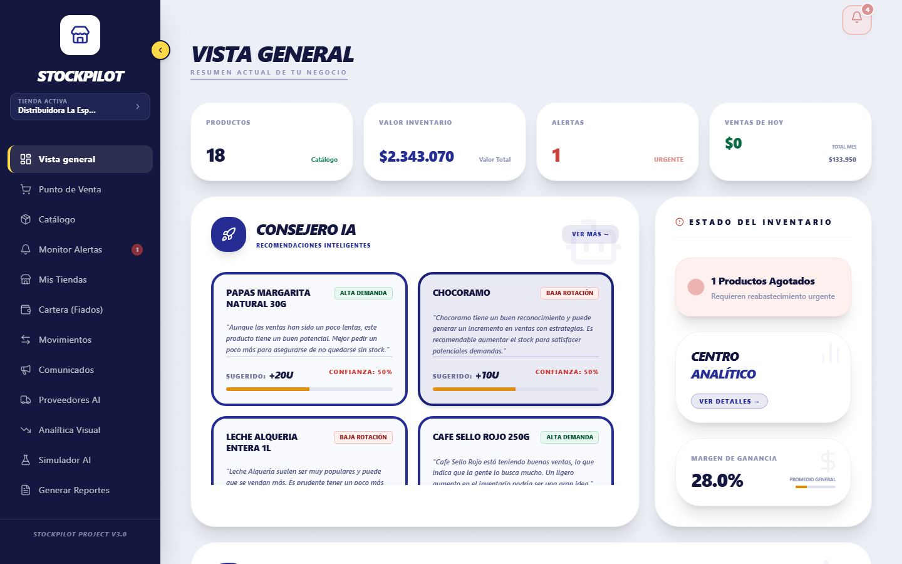

# Plan 11: Consejero IA — "Sugerido: +0u"

**Estado:** Implementado y Verificado (rama `fix/consejero-ia-sugerido-cero`)
**Fecha:** 2026-09-20

---

## 1. Síntoma
En el Dashboard, las tarjetas del **Consejero IA** mostraban "Sugerido: +0u" con textos que recomendaban *aumentar* el pedido (Arroz Diana, Agua Cristal, Huevos, Coca-Cola). Una recomendación de comprar 0 unidades es contradictoria y resta credibilidad a la demo.

| Antes | Después |
|---|---|
|  |  |

## 2. Causa (no era un problema de mapeo de campos)
En `controllers/aiController.js` (`getDashboardRecommendations`):

1. Se calcula `base_load` = *stock objetivo − stock actual* (mínimo 0): la cantidad a pedir.
2. Se le entregaban a la IA **los 8 productos que más facturan**, sin mirar si necesitaban reposición.
3. La IA proponía un ajuste porcentual (`+20%`) sobre esa base y el código calculaba `final = ceil(base_load × (1 + ajuste))`.

Los productos que más facturan suelen tener stock de sobra → `base_load = 0` → `final = 0`. Con datos reales de la tienda de prueba (reproducido con una consulta de solo lectura, sin llamar a la IA):

| Producto | Stock | Objetivo | `base_load` |
|---|---:|---:|---:|
| Arroz Diana 1Kg | 69 | 29,9 | **0** |
| Agua Cristal 600ml | 140 | 10,6 | **0** |
| Huevos x30 | 9 | 7,1 | **0** |
| Coca-Cola 350ml | 116 | 41,1 | **0** |
| Papas Margarita | 11 | 26,4 | 16 |
| Leche Alquería 1L | 3 | 12,0 | 9 |
| Chocoramo | 4 | 12,0 | 8 |
| Pan Tajado | 4 | 9,4 | 6 |
| Café Sello Rojo | 8 | 9,3 | 2 |

Es decir: los productos que **sí** necesitaban reposición nunca llegaban al Consejero, y los que no la necesitaban aparecían con "+0u".

## 3. Corrección
- **Nuevo `utils/recomendacionesDashboard.js`** (reglas puras, sin BD ni OpenAI):
  - `seleccionarCandidatosReabastecimiento(items, 8)`: solo productos con `base_load > 0`, ordenados por urgencia (`CRÍTICO` → `MEDIO` → `BAJO`) y, a igual riesgo, por facturación.
  - `esRecomendacionAccionable(rec)`: descarta sugerencias de 0 unidades (cinturón y tirantes por si la IA devuelve un ajuste que las anule).
- **`aiController.js`:**
  - Se envían a la IA únicamente los candidatos.
  - Si **ningún producto necesita reposición**, se responde `recommendations: []` sin llamar a OpenAI (ahorra una llamada) y el Dashboard muestra su estado "Sistemas estables", en vez de la tarjeta "Motor IA en mantenimiento".
  - **Clave de caché nueva** (`RECS_V2_<tienda>`): la caché se indexa por el hash de los datos, así que con los mismos datos seguiría sirviendo las recomendaciones antiguas con "+0u".
  - Se endureció la lectura de la respuesta de la IA: el `id` se compara como texto y se tolera un `adjustment` ausente. En la primera verificación en vivo la llamada cayó al mensaje de mantenimiento; la causa exacta no quedó registrada (sospecha: id como texto o ajuste ausente).

### Resultado en vivo (tienda de prueba)
| Producto | Base | Ajuste | Sugerido |
|---|---:|---:|---:|
| Papas Margarita Natural 30g | 16 | +20 % | **20 u** |
| Chocoramo | 8 | +20 % | **10 u** |
| Leche Alquería Entera 1L | 9 | +20 % | **11 u** |
| Café Sello Rojo 250g | 2 | +50 % | **3 u** |
| Pan Tajado 500g | 6 | +20 % | **8 u** |

## 4. Verificación
- **Pruebas unitarias nuevas** (`tests/business_logic/ai_recomendaciones_dashboard.test.js`, 8 casos): exclusión de `base_load = 0`, orden por urgencia, respeto del orden de entrada, límite, lista vacía, riesgo desconocido y filtro de sugerencias no accionables. Suite completa: **140 ✅** (antes 132).
- ESLint del backend: 0 problemas. `node --check` sin errores.
- Comprobación con el backend real: una llamada a `/api/ia/recommendations` (la misma que hace el Dashboard al cargar) devolvió 5 recomendaciones, todas con cantidad > 0.

## 5. Observaciones
- **La tendencia se calcula con muestras muy pequeñas** (`velocity_7d / velocity_30d` da 3,48× con 0,53 u/día) y multiplica el stock objetivo sin tope. Con pocos datos exagera la demanda ("Alta demanda"). Conviene acotarla (p. ej. 0,5×–2×) o exigir un mínimo de ventas.
- **Confianza 50 %/20 %** en todas las tarjetas: es el valor por defecto cuando no hay historial de retroalimentación de la IA (`Feedback_IA`).
- **Etiqueta de tendencia (corregida):** el Dashboard mostraba "BAJA ROTACIÓN" para cualquier tendencia distinta de `alcista`, incluida `estable` (p. ej. Chocoramo, cuyo texto pedía aumentar el pedido). Ahora: `alcista` → ALTA DEMANDA, `bajista` → BAJA ROTACIÓN, `estable` → DEMANDA ESTABLE (`DashboardPage.jsx`).
